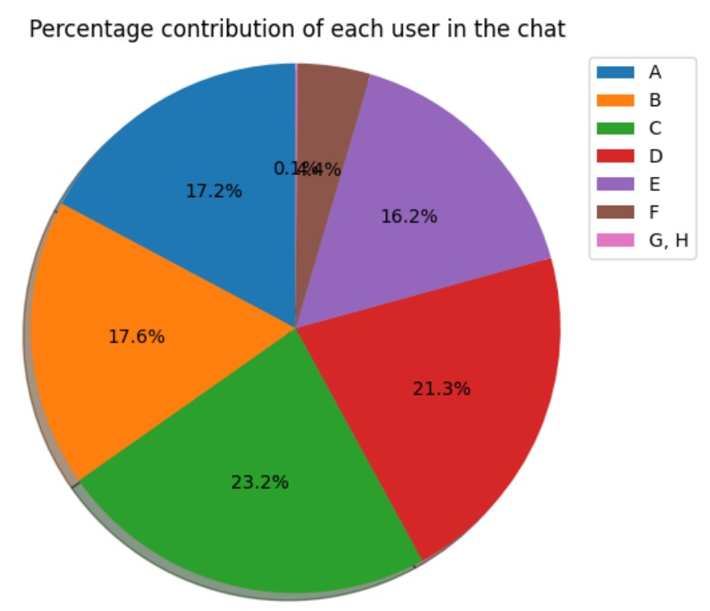

# Chat Analyzer

## Description

This program analyzes the given exported chat for:
- What is the percentage contribution (in terms of number of messages) of a user in the chat
- How active each user is in the chat
- How many times each user has started a conversation in the chat
- Has a user's (or the whole chat's) interaction increased or decreased

It also allows the user to add some constraints (Like generating results only for a particular user and/or generating results within a given time frame) and generate graphs for some actions.

If you want to run your own analysis, to avoid parsing the chatfile and extracting it's data yourself, the program can also export the chat data after converting it into a standard json format.

The program currently works for Whatsapp, Signal and Telegram chat exports. To know how to export chats from the supported platforms, checkout the steps [here](docs/how-to-export.md)

## How to Run

First install the required dependencies using the command:

    pip install -r requirements.txt

Then you can run the program, by entering the `src` directory and then running the following command:

    python chat_analyzer.py <options> <path_to_chatfile>

To know about the available options run the command:

    python chat_analyzer --help

## Testing

To test changes, enter the `tests` directory and run the following command:

    pytest tests.py
